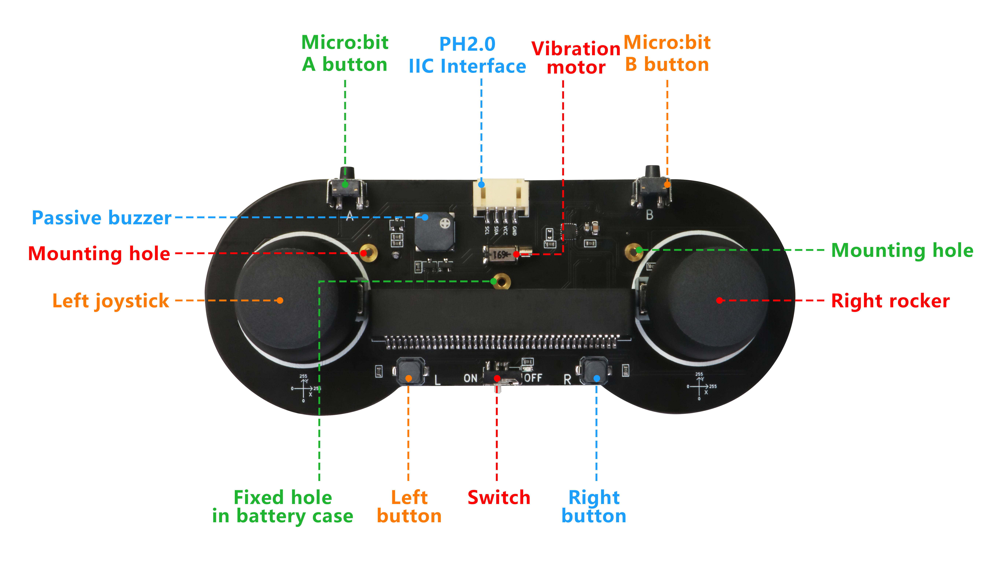
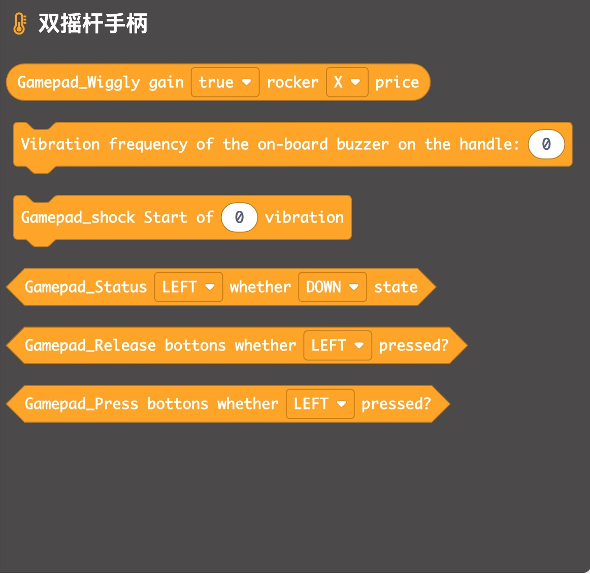
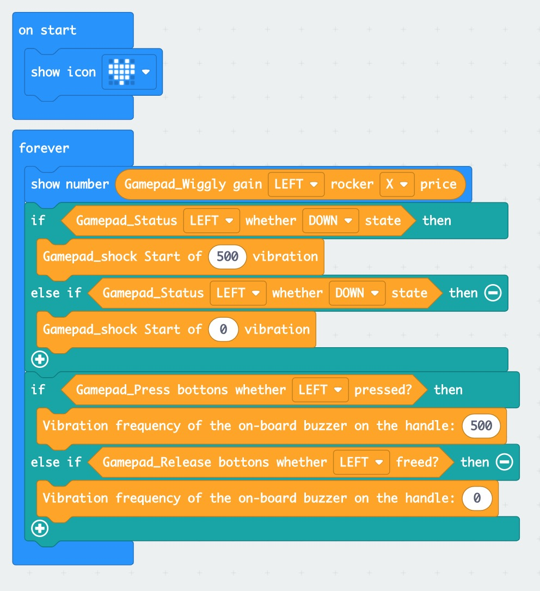
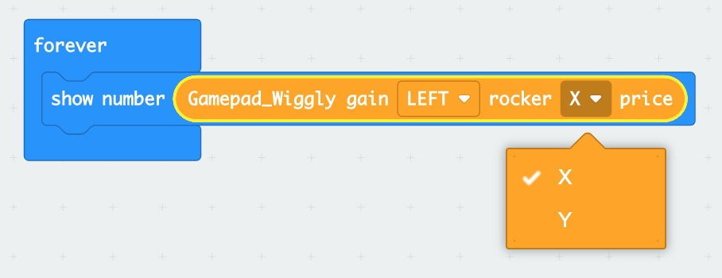
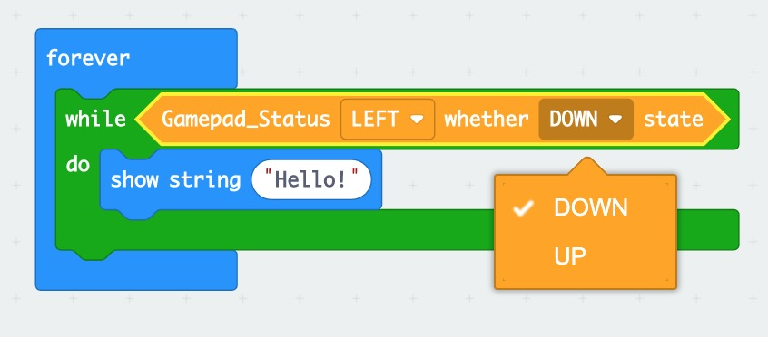
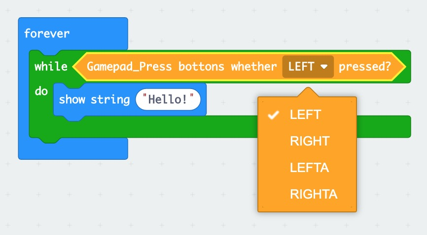
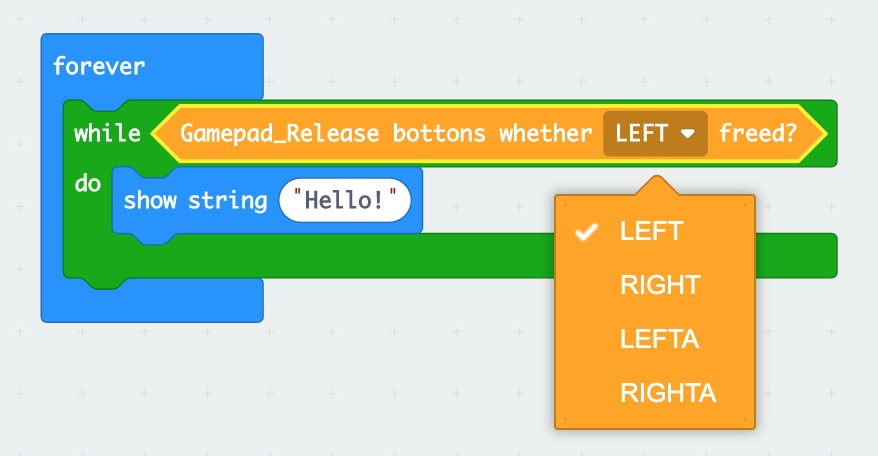
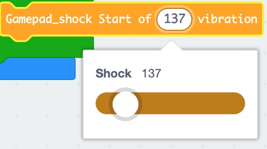
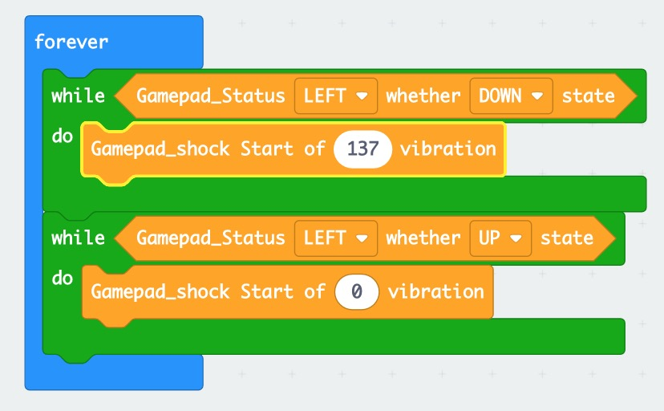
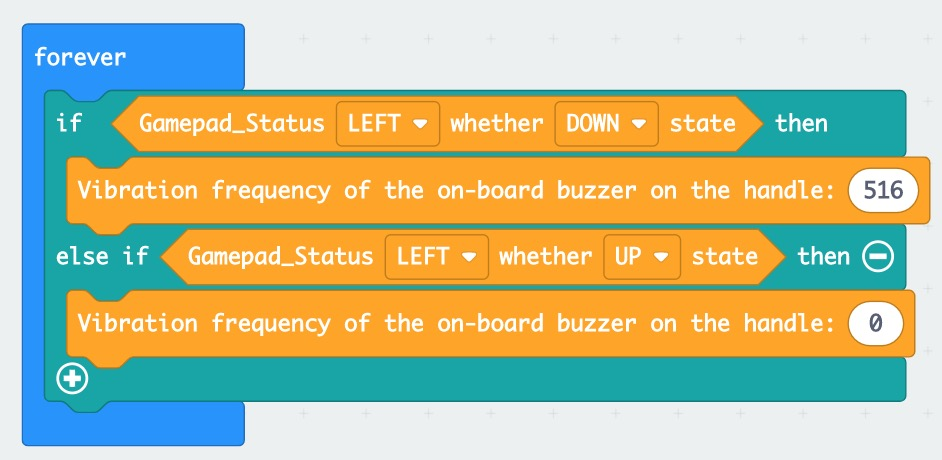

# joystick:bit
English[ 中文版](README_zh.md)

Joystick: Bit is a wireless programmable controller developed for Micro: Bit, which is produced by [Shenzhen E-Innovation Space Technology Co., Ltd.](www.emakefun.com) and supports Micro: Bit V1 and V2

## characteristic

- Left and right rockers

- The joypad extends the Microbit A, B buttons

- Left and right programmable independent keys

- Board buzzer and vibration motor

- Powered by 2 # 7 batteries

- 1 PH2.0-4PIN I2C interface

  
  
  

## Graphic programming block description

   - "GamePad Joystick to get left/right X/Y axis values" : This module is used to get the coordinate values of the left or right joystick in the X or Y axis direction. The values obtained are numeric types and can be displayed on the Micro: BIT board through the 'Show Number' module
   - "Game gamepad vibration frequency ()" : This module is used to debug the vibration frequency of the vibration motor on the game gamepad. When its value is 0, the vibration motor stops vibrating.
   - "Key L/R/ left joystick key/right joystick key is pressed/released" : This module is used to determine whether the left and right joystick key and the joystick center key are pressed or released, and it returns true or false, which is used to determine the module (if...Then execute...)
   - "Key L/R/ left joystick key/right joystick key is pressed/released" : This module is used to determine whether the left and right joystick key and the joystick center key are pressed or released, and it returns true or false, which is used to determine the module (if...Then execute...)
   - "Gamepad Button L/R/ Left Joystick Button/Right Joystick Button Released" : This module is used to determine if the joystick button is not held down, if it returns true or if it returns false.

   

   - The following is the meaning of the composite module
     
     :
     
     - After the module code is successfully downloaded to Micro: Bit, the LED display of Micro: Bit displays the digital heart, and then continuously gets and displays the X axis coordinate of the left rocker.When the L key is pressed, the vibration motor starts to vibrate at a frequency of 500Hz and stops vibrating when the release button L.When the R button is pressed, the on-board buzzer starts working at a frequency of 500Hz and stops working when the R button is released.

   

###  Joystick graphic block

- Get the X/Y value of the gamepad joystick (get the left/right X/Y value and display it on the LED display)

   

   

### Independent key programming graphics block

- Whether the L/R/ left rocker key/right rocker key is pressed/released
- When you press the L key, the string "Hello" is displayed.

   

   

- Similarly, the following two modules determine whether a key was pressed or not, and if true, the string "Hello" is displayed.

   

   

### Vibration motor programming graphics block

- Game gamepad vibration frequency module can debug the vibration frequency of vibration motor

   

- Use with the key: when you press the L key, the vibration motor starts to work, the frequency is 137Hz.When you release the key L, the vibration motor stops working.

   

###  On board buzzer programming graphics fast

- The vibration frequency module of the on-board buzzer on the game controller can debug the vibration frequency of the on-board buzzer

   

- When you press the L key, the onboard buzzer will start working with a frequency of 516Hz. When you release the L key, the onboard buzzer will stop working with a frequency of 0.

  

# # # python support

## Open source license
MIT
